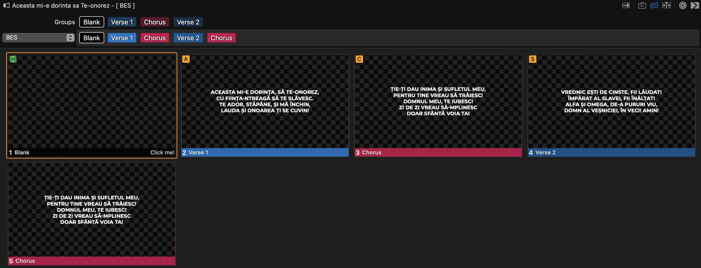
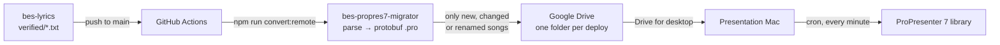

# bes-propres7-migrator

[](https://github.com/ioanlucut/bes-propres7-migrator/actions/workflows/ci.yml) [](LICENSE)  

**Turns a Git-managed song library into native ProPresenter 7 presentations, and ships only what changed to the presentation Mac.**

ProPresenter's `.pro` format is an undocumented binary protobuf. Instead of scripting the app or hand-importing lyrics, this project reverse-engineers ProPresenter's schemas and writes presentations directly: slides, section groups, a ready-to-play arrangement, CCLI metadata and a setup macro, generated from plain-text lyrics.



## In production

Since March 2023 this pipeline has generated the entire worship library of Biserica Emanuel Sibiu (BES): roughly 1,900 songs, maintained as text files in [`bes-lyrics`](https://github.com/ioanlucut/bes-lyrics). Songs are not imported or edited by hand in ProPresenter: a lyric fix merged on GitHub is converted in about 30 seconds and moved into the library on the presentation Mac by its next sync.



## Highlights

- **Native `.pro` files from reverse-engineered protobuf.** The 121 `.proto` schemas in [`proto/`](proto/) were extracted from the ProPresenter binary with [`protodump`](https://github.com/arkadiyt/protodump) and compiled to typed TypeScript with [`ts-proto`](https://github.com/stephenh/ts-proto), so every presentation is built as a typed object and encoded exactly as ProPresenter stores it. See [ProPresenter format](docs/propresenter-format.md).

- **Arrangements that follow the song.** Each section becomes one group, and a `BES` arrangement replays the groups in the song's sequence. The chorus exists once but plays everywhere it is sung, so the operator only ever presses → during worship.

- **A setup slide that runs a macro.** Every song opens on a blank slide that triggers a ProPresenter macro, which prepares the screens before the first lyric appears.

- **Incremental, versioned deploys.** Each deploy writes a manifest of song IDs and content hashes, diffs it against the previous deploy, and uploads only new, changed or renamed songs into a timestamped Google Drive folder, together with the list of songs to remove. See [Architecture](docs/architecture.md).

- **Romanian typography that survives RTF.** Slide text is RTF; the converter escapes diacritics (`ă â î ș ț`) and typographic quotes (`„ ” ‘ ’`) to RTF Unicode, including RTF's habit of swallowing the space after a control word. Snapshot tests pin the output.

- **The last mile is automated too.** A cron job on the presentation Mac moves each deploy into the ProPresenter library ([`client-sync-macos/`](client-sync-macos/)), and a one-click AppleScript switches the displays between ProPresenter and PowerPoint layouts ([`displays-switch/`](displays-switch/)).

## Quick start

Requires Node.js 20 or newer.

```bash
git clone https://github.com/ioanlucut/bes-propres7-migrator.git
cd bes-propres7-migrator
npm ci
```

Point `LOCAL_SOURCE_DIR` in [`.env.local`](.env.local) at a folder of songs (it defaults to a sibling checkout of [`bes-lyrics`](https://github.com/ioanlucut/bes-lyrics)), then convert:

```bash
npm run convert:local
```

The `.pro` files and a `manifest.json` are written to `out_temp_for_local/<YYYY-MM-DD-HH:MM:SS>/`. Copy them into a ProPresenter library folder (by default under `~/Documents/ProPresenter/Libraries/`), which is what the [presentation Mac sync](client-sync-macos/README.md) automates. Later runs only write songs that changed since the previous run.

## Song format

One `.txt` file per song: a title with metadata, the sequence to play, then the sections.

```text
[title]
Aceasta mi-e dorința, să Te-onorez {id: {8ipLZddXG3Zy7Hbbo93Vm7}, contentHash: {418384}}

[sequence]
v1,c,v2,c

[v1]
Aceasta mi-e dorința, să Te-onorez,
Cu ființa-ntreagă să Te slăvesc.

[c]
Ție-Ți dau inima și sufletul meu,
Pentru Tine vreau să trăiesc!

[v2]
Vrednic ești de cinste, fii lăudat!
Împărat al slavei, fii înălțat!
```

| Section    | Codes         | ProPresenter group            |
| ---------- | ------------- | ----------------------------- |
| Verse      | `v1`, `v2`, … | `Verse 1`, `Verse 2`, …       |
| Pre-chorus | `p`, `p2`, …  | `Prechorus`, `Prechorus 2`, … |
| Chorus     | `c`, `c2`, …  | `Chorus`, `Chorus 2`, …       |
| Bridge     | `b`, `b2`, …  | `Bridge`, `Bridge 2`, …       |
| Recital    | `s`, `s2`, …  | `Recital`, `Recital 2`, …     |
| Ending     | `e`           | `Ending`                      |

A long section can be split across slides with sub-sections such as `v1.1` and `v1.2`, which ProPresenter labels `1/2` and `2/2`. The full rules, including what fails a deploy, are in [Song format](docs/song-format.md).

## Configuration

[`runner.ts`](runner.ts) holds the BES settings and picks the local or remote mode:

| `Config` field               | Purpose                                | BES value                       |
| ---------------------------- | -------------------------------------- | ------------------------------- |
| `arrangementName`            | Name of the generated arrangement      | `BES`                           |
| `ccliSettings`               | CCLI publisher, author, album and year | Church name and year            |
| `fontConfig`                 | Slide font                             | `CMG Sans Cn CAPS`, bold, 58 pt |
| `graphicSize`                | Slide size                             | 1920 × 1080                     |
| `presentationCategory`       | ProPresenter category                  | `Worship Songs ~ BES <year>`    |
| `refMacroId`, `refMacroName` | Macro run by the first slide           | The `Songs` macro               |

| Environment variable                                                                  | Used by | Purpose                                                                 |
| ------------------------------------------------------------------------------------- | ------- | ----------------------------------------------------------------------- |
| `LOCAL_SOURCE_DIR`                                                                    | both    | Folder with the `.txt` songs, read recursively                          |
| `LOCAL_OUT_DIR`                                                                       | both    | Where each run's folder is written                                      |
| `CONNECT_TO_G_DRIVE`                                                                  | both    | `true` uploads to Google Drive; anything else stays local               |
| `TZ`                                                                                  | both    | Time zone of the timestamped folder names                               |
| `GDRIVE_ROOT_FOLDER_ID`                                                               | remote  | Google Drive folder that receives one sub-folder per deploy             |
| `GDRIVE_BES_CLIENT_ID`, `GDRIVE_BES_CLIENT_SECRET`, `GDRIVE_BES_CLIENT_REFRESH_TOKEN` | remote  | OAuth credentials; see [Google Drive setup](docs/google-drive-setup.md) |
| `FORCE_RELEASE_OF_ALL_SONGS`                                                          | remote  | `true` re-uploads every song instead of the diff                        |

Remote mode runs with `npm run convert:remote`, which reads [`.env.remote`](.env.remote); in production the [`bes-lyrics` deploy workflow](https://github.com/ioanlucut/bes-lyrics/blob/main/.github/workflows/deploy_to_gdrive.yml) runs it on every push that touches `verified/`.

## Repository map

```text
src/                 parser, protobuf converter, local and Google Drive deploy runners
proto/               ProPresenter 7 protobuf schemas and the generated TypeScript
rtfs/                RTF template used for slide text
mocks/               song fixtures for the tests
client-sync-macos/   cron sync from Google Drive into the ProPresenter library
displays-switch/     one-click display layouts for ProPresenter and PowerPoint
windows-templates/   reference .pro files saved by ProPresenter for Windows
docs/                architecture, formats and setup guides
```

## Development

| Command                    | What it does                                                     |
| -------------------------- | ---------------------------------------------------------------- |
| `npm test`                 | Jest unit and integration tests (watch mode outside CI)          |
| `npm run lint`             | ESLint                                                           |
| `npm run typecheck`        | TypeScript, including the generated protobuf code                |
| `npm run format:check`     | Prettier                                                         |
| `npm run test:sync-script` | Tests the presentation Mac sync script against throwaway folders |

CI runs all of them on every push and pull request.

## Documentation

- [Architecture](docs/architecture.md): the deploy lifecycle and how the manifest diff decides what ships.
- [Song format](docs/song-format.md): the full `.txt` grammar and validation rules.
- [ProPresenter format](docs/propresenter-format.md): how a song maps onto ProPresenter's protobuf model, and how to regenerate or decode it.
- [Google Drive setup](docs/google-drive-setup.md): creating the OAuth credentials for remote deploys.
- [Presentation Mac sync](client-sync-macos/README.md) and [display switch](displays-switch/README.md).

## Adapting it

Built for one church, but only [`runner.ts`](runner.ts) is church-specific. Change the config, point it at your own song folder, and it works for any ProPresenter 7 library. Issues and pull requests are welcome.

## License

[Apache 2.0](LICENSE) © Ioan Lucut
