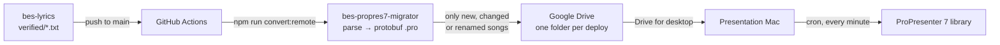

# Architecture

## The pipeline

Four systems hand a song along, and only the middle one is this repository:



Git is the source of truth and the review step; Google Drive is only a transport that the presentation Mac can reach without any inbound connection, and the Mac never runs the migrator itself.

## Inside the migrator

The migrator is a batch job: it reads every song, decides which ones changed since the last deploy, converts those to `.pro` files, and publishes them as a new timestamped folder. Both modes share one pipeline and differ only in where the previous deploy lives and where the new one goes.

```text
runner.ts ── Config + env ──┐
                            ▼
converterService.getBasicDeploymentInfo
  ├─ getDeployableSongs      read every .txt under LOCAL_SOURCE_DIR → songsParser.parseSong
  ├─ id check                every song needs an `id`, and ids must be unique
  └─ generateManifest        [{ id, fileName, contentHash }] sorted by file name
                            │
            ┌───────────────┴────────────────┐
            ▼                                ▼
  localConverterRunner              gDriveConverterRunner
  previous = newest folder          previous = newest folder
  in LOCAL_OUT_DIR                  in GDRIVE_ROOT_FOLDER_ID
            │                                │
            └──── getSongDiffFromManifest ───┘
                            │
                            ▼
  proPresenter7SongConverter → Presentation.encode() → <LOCAL_OUT_DIR>/<timestamp>/*.pro
                            │
                            ▼  remote mode only
  gDriveService.uploadAssetsToGDrive → new Drive folder <timestamp>/
```

| Module                                                                                                                                                                                   | Responsibility                                                                                                    |
| ---------------------------------------------------------------------------------------------------------------------------------------------------------------------------------------- | ----------------------------------------------------------------------------------------------------------------- |
| [`songsParser.ts`](../src/songsParser.ts)                                                                                                                                                | Splits a `.txt` song into title, metadata, sequence and sections, and rejects sections missing from the sequence. |
| [`proPresenterMatchingGroupDeriver.ts`](../src/proPresenterMatchingGroupDeriver.ts), [`proPresenterMatchingSubGroupLabelDeriver.ts`](../src/proPresenterMatchingSubGroupLabelDeriver.ts) | Map a section code such as `c2` or `v1.2` to its ProPresenter group (`Chorus 2`) and slide label (`2/2`).         |
| [`proPresenter7SongConverter.ts`](../src/proPresenter7SongConverter.ts)                                                                                                                  | Builds the protobuf `Presentation`; see [ProPresenter format](propresenter-format.md).                            |
| [`txtToRtfConverter.ts`](../src/txtToRtfConverter.ts)                                                                                                                                    | Renders section text into the RTF template, escaping Romanian characters.                                         |
| [`converterService.ts`](../src/converterService.ts)                                                                                                                                      | Shared deploy steps: reading songs, the manifest, the diff and writing `.pro` files.                              |
| [`localConverterRunner.ts`](../src/localConverterRunner.ts), [`gDriveConverterRunner.ts`](../src/gDriveConverterRunner.ts)                                                               | The two deploy modes.                                                                                             |
| [`gDriveService.ts`](../src/gDriveService.ts)                                                                                                                                            | Google Drive client: list deploy folders, read a manifest, upload a deploy.                                       |

## Deploys are folders

Every run creates a folder named after its start time, `YYYY-MM-DD-HH:MM:SS` in the `TZ` time zone. It holds the `manifest.json` of the full library at that moment plus the `.pro` files of the songs that changed. The folders are an append-only history: the newest folder's manifest is the baseline for the next run, and the Mac sync replays folders in name order.

```json
{
  "inventory": [
    {
      "id": "8ipLZddXG3Zy7Hbbo93Vm7",
      "fileName": "Aceasta mi-e dorinta sa Te-onorez.txt",
      "contentHash": "418384"
    }
  ],
  "updatedOn": "2024-04-09-17:18:05"
}
```

A run refuses to write into a folder that already exists, so two runs in the same second fail instead of mixing their output.

## What ships

[`getSongDiffFromManifest`](../src/converterService.ts) compares the new manifest with the previous one by song `id`, so a song keeps its identity through renames:

| Change since the previous deploy   | Converted and shipped | Listed in `songsToBeDeleted.json` |
| ---------------------------------- | --------------------- | --------------------------------- |
| New `id`                           | yes                   | no                                |
| Same `id`, different `contentHash` | yes                   | no                                |
| Same `id`, different file name     | yes                   | old file name                     |
| `id` no longer present             | no                    | old file name                     |
| Unchanged                          | no                    | no                                |

The `contentHash` comes from the song file itself, where [`bes-lyrics`](https://github.com/ioanlucut/bes-lyrics) maintains it, so the migrator never hashes lyrics and the upstream repository stays the source of truth.

## Remote deploy, step by step

1. Check that every required environment variable is set.
2. Parse all songs and build the manifest; any invalid song aborts the run before anything is uploaded.
3. List the deploy folders under `GDRIVE_ROOT_FOLDER_ID`. With none, or with `FORCE_RELEASE_OF_ALL_SONGS=true`, convert and upload every song.
4. Otherwise download the newest folder's `manifest.json` and diff against it.
5. With no changes, stop without creating a Drive folder.
6. Convert the changed songs, then create the new Drive folder and upload `manifest.json`, `songsToBeDeleted.json` and the `.pro` files, five uploads at a time.

The local mode follows the same steps against sub-folders of `LOCAL_OUT_DIR` and prints the songs to remove instead of uploading a list.

## After the upload

Google Drive for desktop mirrors the deploy folders onto the presentation Mac, where a cron job moves the `.pro` files into the ProPresenter library every minute; see [Presentation Mac sync](../client-sync-macos/README.md). Removed songs are listed but deleted by hand, so an automated mistake can never delete a song from a live library.
